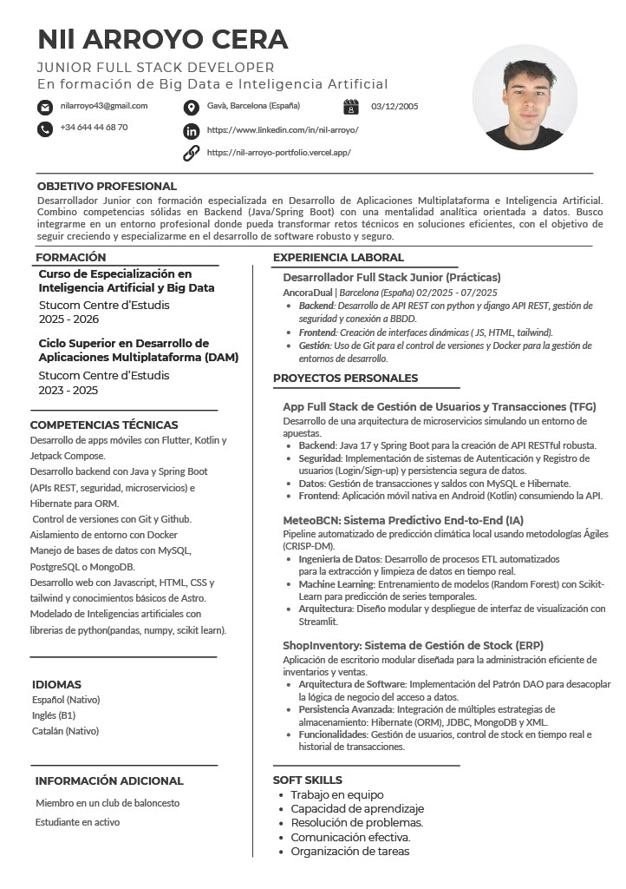

# 🚀 Nil Arroyo - Portfolio Personal


 Bienvenido al repositorio de mi portafolio profesional. Este proyecto ha sido diseñado para ser rápido, accesible y visualmente impactante, sirviendo como punto central para mostrar mi experiencia como **Full Stack & AI Developer**.

🔗 **Demo en vivo:** [https://nilarroyo.vercel.app](https://nilarroyo.vercel.app)

## 🛠️ Tecnologías

Este proyecto aprovecha la arquitectura de "Islas" de Astro para ofrecer un rendimiento máximo con 0 JavaScript innecesario en el cliente.

* **Core:** [Astro](https://astro.build/) (v5) - Para generación estática y rendimiento.
* **Estilos:** [Tailwind CSS](https://tailwindcss.com/) (v4) - Diseño responsivo y moderno.
* **Iconos:** `astro-icon` con librerías `simple-icons` y `tabler`.
* **Componentes:** Integración agnóstica (HTML estático + componentes interactivos puntuales).
* **Despliegue:** Vercel (CI/CD automático desde GitHub).

## ⚡ Características Clave

* **Rendimiento 100/100:** Optimizado para Core Web Vitals.
* **Diseño One-Page:** Navegación fluida con `IntersectionObserver` para detectar la sección activa.
* **Modo Oscuro:** Diseño nativo "Dark Mode" con paleta de colores profesional.
* **Animaciones CSS:** Efectos de brillo (shine effects), carrusel infinito y transiciones suaves sin librerías pesadas de JS.


## 📂 Estructura del Proyecto

```text
/
├── public/          # Assets estáticos (Imágenes, CV, Favicon)
├── src/
│   ├── components/  # Componentes UI reutilizables (Hero, Navbar, Projects...)
│   ├── layouts/     # Layout principal (SEO, Meta tags, Estilos globales)
│   ├── pages/       # Rutas (index.astro)
│   └── styles/      # Configuración de Tailwind y CSS global
└── astro.config.mjs # Configuración del compilador